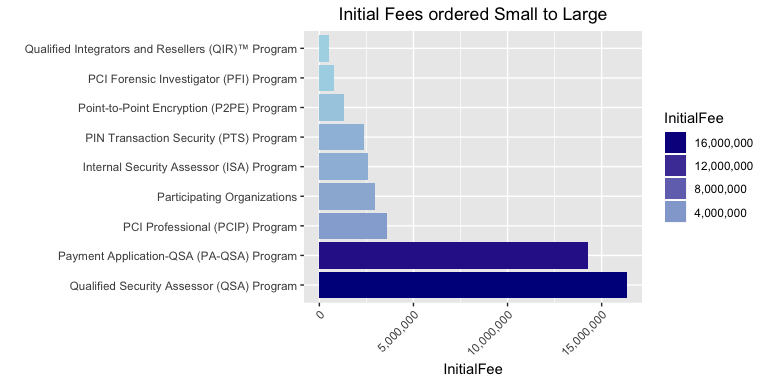
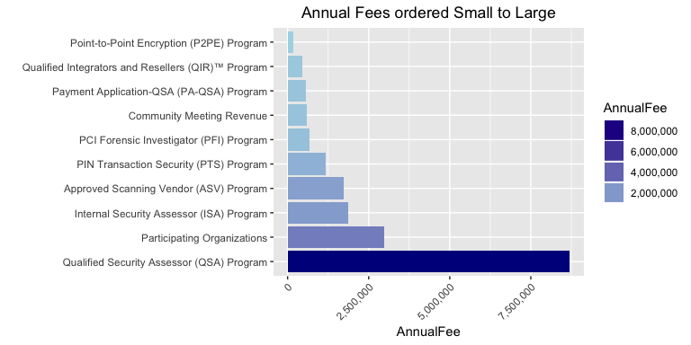

# PCI Program Fee Analysis

## Introduction 

### How to Use this Document
This is an RMarkdown report that can be compiled on the fly. It is presented free of charge with no expressed or implied warranties. **USE AT YOUR OWN RISK**. After you clone the GitHub project, just go re-export all the public information available on the Council's website and re-knit this document. 

## PCI Program Fee Analysis
The following HTML document (and R package/analysis for your own use) is a quick and dirty analysis of the revenue generating capabilities of the PCI Security Standards Council. This is by no means fully representative of their current financial status. The Council is formed as an LLC and does not have Tax Exempt status (or at least, they have never filed an IRS Form 990). It's highly unlikely that anyone outside of ExecCo (the Council's governing committee) will be able to see actual financial statements as this is a for-profit institution. 

You read that right, it's a *for-profit* entity.

Dun & Bradstreet [recently reported](SupportingDocs/PCI Council Report.pdf) the Council's annual revenue as $3.7M, however, quick and dirty math shows this is woefully understated.

## Revenue Summary
The following summary contains all results possible to calculate based on the data provided on the Council's website. All fees on the website are in US Dollars. Some programs, such as Acquirer and Awareness training, have fees listed on the website but no public details on the number of individuals trained in each program.

Program | Initial Fee | Annual Fee |
------- | ----------- | ---------- |
Participating Organizations | $3,067,500 | $3,067,500
Approved Scanning Vendor (ASV) Program | *N/A* | $1,906,850
Internal Security Assessor (ISA) Program | $2,568,410 | $1,881,210
Payment Application-QSA (PA-QSA) Program | $13,235,400 | $600,820
PCI Forensic Investigator (PFI) Program | $979,250 | $871,750
PCI Professional (PCIP) Program | $3,614,910 | *N/A*
PIN Transaction Security (PTS) Program | $2,472,000 | $1,236,000
Point-to-Point Encryption (P2PE) Program | $1,254,400 | $171,600
Qualified Integrators and Resellers (QIR)™ Program | $412,800 | $344,000
Qualified Security Assessor (QSA) Program | $15,520,400 | $8,283,000
Community Meeting Revenue | *N/A* | $600,000
**TOTALS** | **$43,125,070** | **$18,962,730**

The following two graphs break out the difference in program revenues visually. The QSA program, one of the first two launched by the Council, is by far the largest revenue generator. This makes sense given the number of firms who play in the assessment space and the general demand for assessment services.

<!-- -->

<!-- -->

## Detailed Analysis
In the following sections, we will dive into some more detail around the revenue generation capabilities of the Council's individual programs.

### Public Information Disclosure
All of the information that is found here is publicly available. Several additional elements could not be included due to confidentiality agreements and a lack of currency. The information and analysis provided here only represents a portion of the total picture and should be considered for entertainment use only. 

### Revenue
Revenue for the Council comes in a number of ways, many of which are [published here](https://www.pcisecuritystandards.org/program_training_and_qualification/fees#paqsa_pricelist). 

* Participating Organizations fees
* Approved Scanning Vendor (ASV) Program fees
* Internal Security Assessor (ISA) Program fees
* Payment Application-QSA (PA-QSA) Program fees
* PCI Acquirer Training fees\* 
* PCI Awareness Training fees\*
* PCI Forensic Investigator (PFI) Program fees
* PCI Professional (PCIP) Program fees
* PIN Transaction Security (PTS) Program fees
* Point-to-Point Encryption (P2PE) Program fees
* Qualified Integrators and Resellers (QIR)™ Program fees
* Qualified Security Assessor (QSA) Program fees
* Community Meeting Sponsorship fees

These programs represent the majority of the different sources, but there are additional revenue influxes during the year. The Community meeting alone provides revenue from additional attendee registrations (some registrations are not included) and vendor sponsors that pay for various items such as lanyards, lunches, and booths ranging in costs from one or two thousand to tens of thousands of dollars. If you are interested in seeing all of the possible options, see the [2016 Prospectus here](SupportingDocs/2016_PCI_Sponsorship_Prospectus.pdf). A conservative estimate would be $600K in revenue from the meetings in 2016. In addition, two of the above programs provide opportunities for revenue but no public data on consumption is available.

\* These fee programs do not have any public data on their usage. 

#### Initial vs. Annual Fees
One element that may seem strange to you is the distinction between an Initial fee and an Annual fee. Nearly all of the programs put on by the Council have both. The Initial fee is the first fee an entity pays to become listed or join the program. It is often higher (usually 2x the annual fee), but not in every case. This is a one-time revenue bump. So when you consider the initial understated revenues of $43,125,070 for all of the programs, keep in mind that this revenue has been trickling in since 2006 when the Council launched. Acquirer and Awareness training revenue would increase this number as it is not guaranteed year over year.

Annual fees, as defined, come in every year. This analysis considers Community Meeting as annual because there are multiple meetings in various regions around the world. The numbers are slightly understated due to a number of assumptions that are outlined in both this document and the [PCI Analysis.R](PCI Analysis.R) document included in this package. Given the conservative nature of these assumptions, it's a virtual guaranteeing that the actual revenue is greater than what is calculated here. The only way it could be lower is if people are getting a free pass (not paying their fees) or an accounting error.

### Expense
The expense side of the Council comes in a few categories, much like any other company in the ecosystem. Salaries of employees, SG&A+Travel expenses, producing the Community Meetings, licensing for training and other IT needs, and their management company. None of the expense information information is public. Let's assume they are operating at a positive margin, meaning they earn more revenue than they pay out in expense every year.

## The QSA Program
The QSA program was one of the two original programs launched by the Council in 2006, moving the administration of Assessors away from the payment brands and into the independent Council entity. The dataset loaded contains 366 QSA records. 

### Approach

The data, as exported, represents a list of all QSA companies, the languages they speak, and the markets they serve (among a few other data elements). The markets served drive the registration fees, which is the focus of this review. That column was essentially a nested CSV, which needed to be split out to get each QSAC listed with each market. 

*PLEASE NOTE:* Because this data is [one order tidier](https://www.jstatsoft.org/index.php/jss/article/view/v059i10/v59i10.pdf) than the original CSV, there are more entries in some of the analysis than there are QSAs. As an example, if a firm has paid for the US and Europe, they will have two entries in the markets served. Large firms may have multiple entries, while small firms will only have few or one.

### Summary Findings

The below plot shows the count of QSAs by Market. The Asia Pacific region seems to include the most single-country registrations, while the US and Europe lead the way for sheer numbers of firms. 

<!-- -->

### Initiation Fees

The Council collected an aggregate amount of $9,405,000 from current QSA companies. Keep in mind, this is a one time fee, there is no accounting for price increases, and there are firms who are no longer on this list. You should interpret this number as smaller than the total amount of dollars collected for each new firm. Consider it an ante, if you will, that the Council draws down on as they validate the firm initially.

The Council collected an aggregate amount of $6,115,400 for the initial training for each individual who goes through QSA training. This number is grossly under represented as the number of total QSAs over the lifetime of the program is much larger than the current QSA count (yours truly being one of the hundreds who are recovering). If you want the actual number here, you would need the total number of QSAs who took the training and attempted the test (not everyone passes). 

Total initial fees for the QSA program are $15,520,400.

### Annual Fees
Annually, the Council collects an additional $4,840,000 annually from the current set of QSA companies. Given the same assumptions above, which are not far off from the numbers presented at the 2017 Community meeting (2,061 QSAs), they also collect an additional $4,840,000 from each individual's re-qualification fee. Combined, that's a total of $8,283,000.

## The ASV Program
This key program is a little difficult to estimate the total annual revenue. ASVs will pay an annual fee, which is the same as the initial qualification test. They can take advantage of a Mid-year test, for example, if they do material changes or upgrades to their engine, they pay for retests if they fail, and there is an ASV training program for any individual associated with the results. There are 110 current ASVs, which at a minimum translates to $1,375,000 of annual revenue. Now comes the assumptions. Let's assume that 5% of companies require some kind of retest ($35,750), 2% of companies take advantage of the mid-year check ($14,300), and four employees from each firm require training  ($481,800). This represents a total of $1,906,850.

## The PA-QSA Program
If memory serves, this was the third program offered by the Council as they took over the PABP program from Visa. Fees are charged for each region as well as for each application that gets listed. Vendor fees are one time and then minor fees for changes (such as version numbers or feature additions). We are only going to focus on the initial listing fees of the 4,364 in addition to the PA-QSA Training and listing fees. 

You may be looking at that number and wondering why it is so high. This number includes existing deployments as well as applications valid for new deployments. So even though the number of applications acceptable for a new deployment is a fraction of the total listing, all applications had to pay the fee to be listed at some point.

<!-- -->

The total amount of revenue associated with listing applications to date is $12,001,000. For the PA-QSA companies and individuals, the fees for initial listing are $13,235,400 and annual re-listing and training is $600,820.

## The P2PE Program
This is one of the more complex programs the Council offers. Fees are charged to two different kind of QSAs as well as to the solutions or applications that are published. We are only going to focus on the qualification of firms, not the solutions (of which, there are 28 today. This would represent at least $138,600 of revenue.

<!-- -->

The fees for initial listing are twice as much as the annual fees, and both require an initial application fee on top of the regional qualification fee. Initial revenue captured is $1,254,400 and annual revenue is $171,600.

## The PFI Program
This program is for the forensic examiners who work the post-breach jobs. There are 21 PFIs with at least one in each available market. 

<!-- -->

The fees for initial and annual are identical with the exception of the added Initial Application Fee. There is no training for individuals like other programs, so all the fees are tied up in being listed in a region. Initial revenue captured is $979,250 and annual revenue is $871,750.

## The QIR Program
The Qualified Integrator Reseller program was designed to combat poor payment application installations. Ideally, acquirers and processors should only board merchants who have had their equipment installed by a QIR, however, this is not universal. Given the fees are tied to individuals once again, we will leverage our four trainees per firm model to come up with an estimate of the revenue associated with the QIR program. There are 344 QIRs listed on the website, which with our assumptions translates to $2,472,000 of initial submission revenue and $1,236,000 of recurring revenue.

## The PTS Program
This is one of the simpler programs managed by the Council. There are only two fees associated with the program--submission and listing. For the purposes here, we assume that the submission is a one-time fee inclusive of the initial listing. For every subsequent year that the vendor wants the device listed, they must pay the annual listing fee. There are 824 currently listed PTS devices, which at a minimum translates to $412,800 of initial qualification revenue and $344,000 of recurring revenue.

## Other Program Fees
Some other programs do not have the same kind of data available such as the number of ISAs and PCIPs. For these calculations, assume that the average initial fee for PCIPs is \$1,495 and the average ISA initiation fee is \$2,200 (there are instances where it is higher in both cases). Using the numbers from the last community meeting, that revenue is estimated as follows:

* Initial PCIP revenue: $3,614,910
* Initial ISA revenue: $2,568,410
* Annual ISA Requalificaation Revenue: $1,881,210
* Annual Participating Organization Revenue: $3,067,500

### What about the fees you can't estimate?
Several of you have pointed out *there are a number of additional fees* we can't really capture here. Fees associated with firms who come and go, reinstatement fees for firms that end up a non-current state, remediation fees for firms that find themselves in the cross hairs of the [controversial QA program](https://blog.anitian.com/the-failure-of-the-pci-dss/), one-off training sessions, and paid speaking engagements. It's safe to assume those numbers are greater than zero and reach into six figures annually.

## Questions and Next Steps
If you have questions or suggestions, please leverage the GitHub repository so we can track and collaborate. If anyone wants to submit patches and improvements, please do so.
